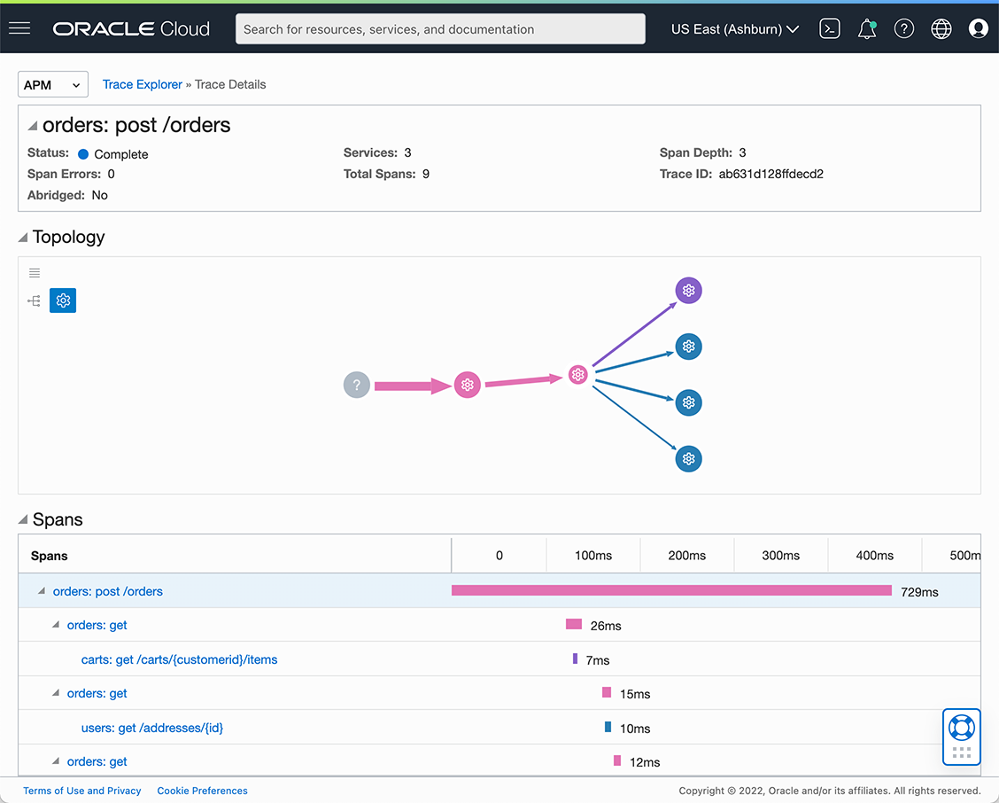

# Oracle Cloud Infrastructure (OCI)

In this guide we illustrate the integration of Coherence Spring Sock Shop with
Oracle Cloud Infrastructure (OCI) Application Performance Monitoring (APM) as another option to process
distributed traces.

To set up Sock Shop with APM, please follow the guide [Complete Application Deployment](complete-application-deployment.md)
but please ignore the section about _Jaeger_.

## OCI APM Documentation

You can find the official OCI APM Documentation at:

- https://docs.oracle.com/en-us/iaas/application-performance-monitoring/index.html

## Setup OCI APM

In order to set up APM we will start from scratch. The only requirement is that you have a valid account for OCI. Here are
the basic steps to set up APM:

1. Login to OCI.
2. Under `Observability and Management`, select `Application Performance Administration`.
3. Click on `Create APM Domain`.
4. Enter a name `Coherence Spring Sock Shop`.
5. For now, we can check the checkbox `Create as Always Free Domain`.
6. Click on the link `Coherence Spring Sock Shop` to enter the `Domain Details` screen.

On the `Domain Details` screen, we are interested in 3 values:

- Data Upload Endpoint
- Private Data Key or
- Public Data Key

We will use these values to construct the _Application Performance Monitoring collector URL_. The APM collector URL has the
following format:

```
<apm-domain-short-id>.<apm-collector-domain>/<API version>/observations/<observationType>
?dataFormat=<dataFormat>&dataFormatVersion=<dataFormatVersion>&dataKey=<dataKey>
```

For detailed information on the _APM Collector URL Format_ see
[the reference guide](https://docs.oracle.com/en-us/iaas/application-performance-monitoring/doc/configure-open-source-tracing-systems.html#APMGN-GUID-B5EDE254-C854-436D-B844-B986A4E077AA).

**Private versus Public Data Key**:

You can either use the Private Data Key or the Public Data Key, depending on your environment. This was built to allow
users to separate traffic that comes from safe locations like your backend servers vs. a non-safe locations like browsers
or in any situation where any end user may look up the traffic and see the data key.

- When using the **Private Data Key** you must also set `<observationType>` to `private-span`.
- When using the **Public Data Key** you must also set `<observationType>` to `public-span`.

In the Sock Shop use-case we will use the private key, but both configurations will work. Your URL should look like this:

```
https://[redacted].apm-agt.us-ashburn-1.oci.oraclecloud.com/20200101/observations/private-span?dataFormat=zipkin&dataFormatVersion=2&dataKey=[private key]
```

## Configure Sock Shop for APM

We need to enable tracing for OCI APM in the `app.yaml` files for each service under the `/k8s/coherence/` folder. Here
we will also set the APM collector URL that we obtained in the previous section. It is important that we split up the
URL into the parts `base-url` and the `api-path`.

We need to specify the following properties and set:

- `management.tracing.enabled` to `true`
- `management.zipkin.tracing.endpoint` to `https://[redacted].apm-agt.us-ashburn-1.oci.oraclecloud.com/20200101/observations/private-span?dataFormat=zipkin&dataFormatVersion=2&dataKey=[private key]`

Your `app.yaml` file should look like this:

```yaml
application:
  main: com.oracle.coherence.examples.sockshop.spring.carts.CartsApp
  args:
    - "--port=8080"
    - "--management.tracing.enabled=true"
    - "--management.zipkin.tracing.endpoint=https://[redacted].apm-agt.us-ashburn-1.oci.oraclecloud.com/20200101/observations/private-span?dataFormat=zipkin&dataFormatVersion=2&dataKey=[private key]"
    - "--coherence.server.startup-timeout=5m"
```

Rebuild and redeploy the Sock Shop services. Now order some socks and afterwards head over to the APM dashboard at:

- https://console.your-region.oraclecloud.com/apm/apm-traces

There, select you `Compartment` and your `APM Domain` and then click on the run button, and you should see the traces
that were emitted from the Sock Shop application.



